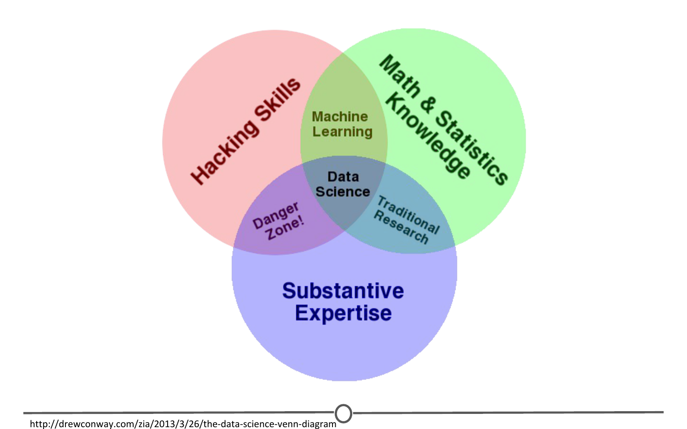

```{r setup, include=FALSE}
knitr::opts_chunk$set(echo = FALSE, 
                      comment = NA)
```

## 01 - What is Data Science?

- No one knows
- Using data to answer questions
- Combination of programming, statistics and storytelling to extract nuggets of gold under mountains of data

### What is Big Data

- Data too big to fit in Excel

Characterised by:

- __Volume__: More and more data is becoming increasingly available
- __Velocity__: Data is being generated at an astonishing rate
- __Variety__: The data we can analyse comes in many forms

### What is a Data Scientist

Intersection of three skillsets:

- __Hacking Skills__
- __Maths & Stats Knowledge__
- __Domain Knowledge__



## 02 - What is Data?

A set of values of qualitative or quantitative variables.

- __Set__: In statistics, the population you are trying to discover something about
- __Variable__: Measurements or characteristics of an item
- __Qualitative__: Measurements or information about qualities
- __Quantitative__: Measurements or information about quantities or numerical items

### Some common types of messy data

- Sequencing data
- Population census data
- Electronic medical records (EMR), other large databases
- Geographic information system (GIS) data (mapping)
- Image analysis and image extrapolation
- Language and translations
- Website traffic
- Personal/Ad data (eg: Facebook, Netflix predictions, etc)
